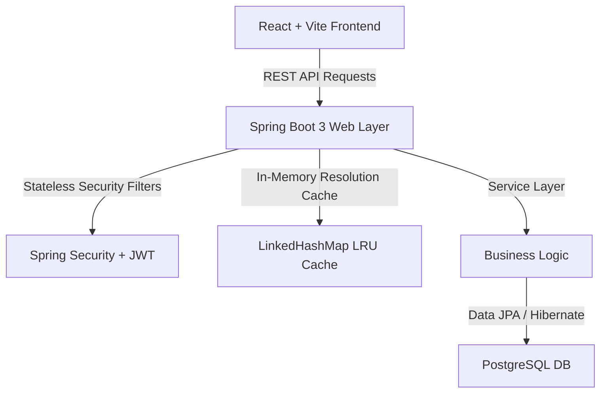

# TrimURL 👋 — Premium URL Shortener & Analytics Suite (Spring Boot & React)

Ever looked at a massive, ugly link and thought, *"I can't send this to someone?"* That's exactly why **TrimURL** exists. It's a modern, full-stack URL shortener that doesn't just shrink your links—it supercharges them.

Built from the ground up with a sleek, distraction-free interface, TrimURL lets you track exactly who is clicking your links, from what devices, and from what browsers. Plus, it packs advanced features like password protection, custom aliases, and self-destructing one-time links.

---

## ✨ Features

- **⚡ Instant Shortening:** Turn massive URLs into clean, short links in a fraction of a second.
- **🏷️ Custom Branding & Aliases:** Define custom URLs (e.g., `trimurl.com/my-launch`) so audiences click with trust.
- **📊 Deep Real-Time Analytics:** Access clean stats capturing browser footprints, operating systems, and device types.
- **📱 Dynamic QR Code Generator:** Instantly download scannable QR codes for presentations, print, or business cards.
- **🛡️ Multi-Level Access Controls:**
  - **Password Protection:** Secure destination redirects behind a password check.
  - **Self-Destructing (One-Time) Links:** Create private links that disappear forever after their first click.
  - **Expiration Timestamps:** Set automatic expiration dates to render URLs inactive after specified times.
- **🌙 Glassmorphic Dark UI:** Beautiful high-contrast, premium interface built for developers and teams alike.

---

## 🛠️ Architecture & Tech Stack



### Frontend Stack:
- **React & Vite:** Fast, optimized single-page bundle.
- **Tailwind CSS:** Fully customized glassmorphic design token system.
- **Lucide Icons:** Clean, minimalist UI iconography.

### Backend Stack:
- **Spring Boot 3 (Java 17):** Production-ready REST APIs.
- **Spring Security & JWT:** Stateless filter chain parsing cookies/headers directly into security contexts.
- **Spring Data JPA & Hibernate:** Object-relational mapping to PostgreSQL schemas.
- **LRU Cache:** Custom, thread-safe, LinkedHashMap-backed cache (Capacity: 500) to resolve shortcodes with instant cache eviction on updates.
- **Rate Limiter Filter:** In-memory request bucket tracking client IPs to prevent authentication attacks.

---

## 💻 Running it on your machine

### Prerequisite Checklist
Make sure you have the following installed:
- **Java JDK 17 or 21**
- **Maven 3.x**
- **Node.js (v18+)**
- **PostgreSQL Database** running on port `5432`

---

### 1. Grab the Repository
```bash
git clone https://github.com/yourusername/URL_Shortner.git
cd URL_Shortner
```

---

### 2. Boot up the Spring Boot Backend
1. Open your PostgreSQL console and create a database named `url_shortener`.
2. Configure your database username, password, and JWT secret in [backend-springboot/src/main/resources/application.properties](file:///c:/Users/Username/Desktop/URL/backend-springboot/src/main/resources/application.properties):
   ```properties
   spring.datasource.url=jdbc:postgresql://localhost:5432/url_shortener
   spring.datasource.username=postgres
   spring.datasource.password=123
   
   # Random JWT signature key (minimum 256 bits)
   jwt.secret=mySuperSecretKeyForJwtTokenGenerationThatIsLongEnough123456
   ```
3. Run the application from your IDE (e.g. IntelliJ IDEA) or via the terminal:
   ```powershell
   cd backend-springboot
   $env:JAVA_HOME="C:\Users\Username\.jdks\ms-21.0.11"
   & "C:\Program Files\JetBrains\IntelliJ IDEA 2026.1.3\plugins\maven\lib\maven3\bin\mvn.cmd" spring-boot:run
   ```
   *(The backend server will launch at `http://localhost:5000`)*

---

### 3. Boot up the React Frontend
Open a new terminal window to start the dev server:
```bash
cd frontend
npm install
npm run dev
```
*(The frontend dashboard will launch at `http://localhost:5173`)*

---

## 🔌 REST API Documentation

Protected routes require secure user context via cookies (`token` / `refreshToken`) or Authorization headers.

### 🔐 Authentication (`/api/auth`)

#### Register Account
- **Endpoint:** `POST /register`
- **Request Body:**
  ```json
  {
    "name": "Alex",
    "email": "alex@gmail.com",
    "password": "Password123!"
  }
  ```
- **Response (201):**
  ```json
  {
    "success": true,
    "message": "Registration successful! Please check your email to verify your account.",
    "user": {
      "id": "e9b25123-1ab2-4b2b-987a-87b6451c234a",
      "name": "Alex",
      "email": "alex@gmail.com",
      "created_at": "2026-07-04T00:59:00Z"
    }
  }
  ```

#### User Login
- **Endpoint:** `POST /login`
- **Request Body:**
  ```json
  {
    "email": "alex@gmail.com",
    "password": "Password123!"
  }
  ```
- **Response (200):**
  ```json
  {
    "success": true,
    "user": {
      "id": "e9b25123-1ab2-4b2b-987a-87b6451c234a",
      "name": "Alex",
      "email": "alex@gmail.com",
      "created_at": "2026-07-04T00:59:00Z"
    }
  }
  ```

---

### 🔗 URLs (`/api/urls`)

#### Create Short URL
- **Endpoint:** `POST /`
- **Request Body:**
  ```json
  {
    "original_url": "https://wikipedia.org/wiki/Systems_architecture",
    "custom_alias": "systems-arch",
    "is_one_time": false,
    "expires_at": "2026-07-15T00:00:00Z"
  }
  ```
- **Response (201):**
  ```json
  {
    "success": true,
    "data": {
      "id": "762b71fa-1234-4b5b-a2c6-ef4172a6b2da",
      "original_url": "https://wikipedia.org/wiki/Systems_architecture",
      "short_code": "8H2vXa",
      "custom_alias": "systems-arch",
      "click_count": 0,
      "expires_at": "2026-07-15T00:00:00Z",
      "is_one_time": false,
      "is_active": true,
      "created_at": "2026-07-04T01:00:00Z"
    }
  }
  ```

---

### 📊 Analytics (`/api/analytics`)

#### Get Dashboard Analytics
- **Endpoint:** `GET /dashboard`
- **Response (200):**
  ```json
  {
    "success": true,
    "data": {
      "summary": {
        "totalUrls": 5,
        "totalClicks": 142,
        "activeUrls": 4
      },
      "topUrls": [
        {
          "id": "762b71fa-1234-4b5b-a2c6-ef4172a6b2da",
          "original_url": "https://wikipedia.org/wiki/Systems_architecture",
          "short_code": "8H2vXa",
          "click_count": 94
        }
      ],
      "breakdowns": {
        "browser": [
          { "name": "Chrome", "value": 85, "percentage": 59.9 },
          { "name": "Firefox", "value": 57, "percentage": 40.1 }
        ],
        "os": [
          { "name": "Windows", "value": 112, "percentage": 78.9 },
          { "name": "macOS", "value": 30, "percentage": 21.1 }
        ],
        "device": [
          { "name": "Desktop", "value": 130, "percentage": 91.5 },
          { "name": "Mobile", "value": 12, "percentage": 8.5 }
        ]
      }
    }
  }
  ```

---

### 🚀 Redirection
- **Endpoint:** `GET /:shortCode`
- **Description:** Accessing `http://localhost:5000/{shortCode}` automatically parses request agents, asynchronously records the click event in the visits database, and redirects the client to the target URL.


---
## 📷 Screenshots


---

## 📜 License

Feel free to use, modify, and distribute this project however you like! It's licensed under the MIT License.
